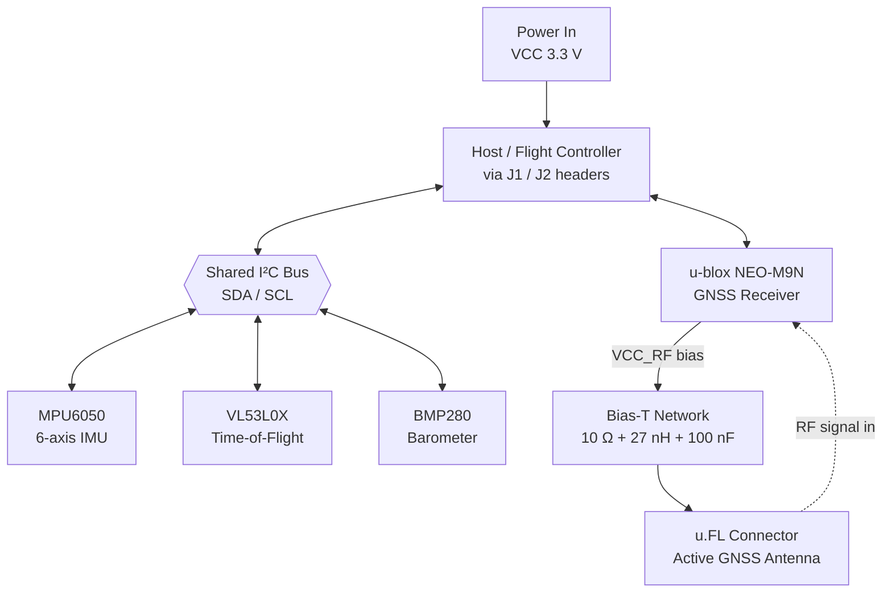

# Aviation Sensors — Multi-Sensor GNSS / IMU / ToF PCB

> A compact 4-layer sensor board that fuses **position**, **motion**, and **distance** sensing into a single module for aviation / UAV applications.


---

## Overview

**Aviation Sensors** is a custom printed circuit board that combines four complementary sensors onto one board so a host flight controller can read absolute position, orientation/motion, barometric altitude, and short-range distance over a small set of interfaces.

| Sensor | Part | Role |
|--------|------|------|
| 🛰️ GNSS receiver | u-blox **NEO-M9N** | Global position / velocity / time |
| 🎯 6-axis IMU | InvenSense **MPU6050** | Acceleration + angular rate (attitude/motion) |
| 📏 Time-of-Flight | ST **VL53L0X** | Short-range distance (e.g. height-above-ground / proximity) |
| 🌡️ Barometer | Bosch **BMP280** | Barometric pressure + temperature → barometric altitude |

### Project Goal

The goal was to design a **single, manufacturable, RF-aware sensor board** that:

- Brings together GNSS, inertial, and ranging data behind a clean host interface
- Handles the **GNSS RF front-end correctly** (controlled-impedance trace + active-antenna bias network) rather than treating the antenna as an afterthought
- Uses a proper **4-layer stackup** with a solid ground reference for signal integrity
- Serves as an end-to-end learning project: schematic capture → layout → DRC → manufacturing-ready output → version control

---

## How It Works

The host (flight controller / MCU) connects through the board headers and talks to the sensors over a shared **I²C** bus plus the GNSS module's host interface. The GNSS module drives an **external active antenna** through a u.FL connector, with a bias network injecting DC power up the RF line.



### Signal flow in brief

1. **Power** enters at the header and feeds the on-board 3.3 V rail and each sensor's supply.
2. **MPU6050**, **VL53L0X**, and **BMP280** share the **I²C** bus (SDA/SCL with pull-ups). The VL53L0X uses **XSHUT** (reset/enable) and **GPIO1** (interrupt) for control; the BMP280 reports pressure/temperature for barometric altitude.
3. The **NEO-M9N** receives GNSS signals from the active antenna and reports position/time to the host.
4. The **active antenna** is powered through a **bias-T**: `VCC_RF → 10 Ω series resistor → node (100 nF to GND) → 27 nH RF inductor → RF line`, so DC reaches the antenna's LNA while RF is blocked from the supply.

---

## Hardware Design

### PCB Stackup (4-layer)

| Layer | Type | Purpose |
|-------|------|---------|
| **L1 — Top** | Signal | Components, signal routing, **50 Ω RF trace** + coplanar ground |
| **L2 — GND** | Plane | Solid ground plane — RF reference + return path *(thin top prepreg ≈ 0.2 mm)* |
| **L3 — GND** | Plane | Second ground plane |
| **L4 — Bottom** | Signal | Additional routing + ground pour |

The thin **L1 ↔ L2** dielectric is what keeps the GNSS RF trace a sane width while holding **50 Ω** characteristic impedance.

### RF Front-End (GNSS antenna)

- **Connector:** I-PEX MHF I / u.FL receptacle (P/N `20279-001E`) — center pad = signal, body pads = ground
- **Trace:** 50 Ω grounded coplanar waveguide (GCPW), kept short and straight, solid ground beneath, via fence along both sides
- **Bias-T:** `R = 10 Ω` (current limit), `L = 27 nH` (Murata `LQW31HN27NJ03L`, RF wirewound), `C = 100 nF` (decoupling to GND)

### Interfaces

- **I²C** (SDA / SCL) — shared between IMU and ToF sensor
- **GNSS host interface** — to flight controller
- **VL53L0X control** — XSHUT (10 kΩ pull-up + host GPIO), GPIO1 (10 kΩ pull-up + interrupt or polled)

---

## 📐 Schematic

<!-- Export from Altium: File > Export, or a high-res screenshot. Save as docs/schematic.png -->


---

## 🧩 PCB Layout


---

## 🧊 3D Render


---

## Bill of Materials (key components)

| Ref | Component | Part Number | Package | Notes |
|-----|-----------|-------------|---------|-------|
| U3 | GNSS receiver | u-blox **NEO-M9N** | LCC / module | GPS/GLONASS/Galileo/BeiDou (L1) |
| U1A | 6-axis IMU | **MPU6050** | QFN-24 | Accel + gyro, I²C |
| U2 | Time-of-Flight | **VL53L0CXV0DH/1** (VL53L0X) | LGA-12 | Default I²C addr `0x29` |
| U | Barometer | Bosch **BMP280** | LGA-8 | Pressure + temp, I²C addr `0x76`/`0x77` |
| J2 | RF connector | I-PEX **20279-001E** | SMT | u.FL / MHF I receptacle |
| L1 | Bias-T inductor | Murata **LQW31HN27NJ03L** | 1206 | 27 nH RF wirewound |
| R1 | Bias-T resistor | — | 0402 | 10 Ω current limit |
| C8 | Bias-T decoupling | — | 0402 | 100 nF |
| J1 | Header | Samtec **TSW-104-26-G-S** | THT | Host interface |

> _See the schematic / `.BomDoc` for the complete, up-to-date BOM._

---

## What I Learned

This project was as much about RF/layout discipline and EDA tooling as it was about the sensors themselves. Key takeaways:

- **"50 Ω" is geometry, not a setting.** Impedance is the *result* of trace width, gap, dielectric height, and Er — you compute the geometry for your stackup, then enforce trace width + clearance via a net class. A ground plane must sit *close* to the RF trace, which is why the stackup matters more than the trace itself.
- **Active antennas need a bias-T.** DC has to reach the antenna LNA up the same coax that carries RF back — a series resistor + RF inductor inject power while a shunt cap keeps the supply clean. The inductor value (27 nH) is band-specific.
- **Odd layer counts are a trap.** A "3-layer" board isn't standard — boards laminate symmetrically, so odd copper counts warp. 4 layers is the right (and cheap) answer, with ground placed asymmetrically close to the top for RF.
- **Internal planes ≠ polygon pours.** Naming a layer "GND" doesn't connect it — the net is assigned in the PCB editor, and planes are negative layers without a one-click "remove dead copper" option.
- **Connector + sensor details matter.** u.FL pad assignment (center = signal), VL53L0X XSHUT/GPIO1 pull-ups, and shared-bus I²C pull-ups are the small things that make or break a working board.
- **Version control for hardware** — Altium files are binary, so Git is great for backup/history but not line-diffs; a proper `.gitignore` keeps generated output out of the repo.

---

## Troubleshooting Log

Real issues hit during this design and how they were resolved — kept here as a reference for the next board.

| Symptom | Root Cause | Fix |
|---------|-----------|-----|
| DRC showed `6.083 < 5` (impossible) solder-mask sliver "violations" | **Stale error markers** not recomputed after editing the rule | `Tools → Reset Error Markers`, then re-run DRC |
| **Net Antennae** violations on vias (`Top → Bottom`) | Internal GND planes had **no net assigned** → vias connected at one end only | Assign **Net = GND** to each plane via double-click in the PCB editor; save + recompile |
| Couldn't connect plane to GND in Layer Stack Manager | Plane net is assigned **in the PCB editor**, not the stack manager | Save stackup → activate plane layer → double-click plane copper → set net |
| Couldn't select/delete pads on the IMU footprint | Pads are **owned by the component** (locked primitives) — not the actual fault | Delete the real culprits (stub copper/vias), not the pads |
| `Isolated / Dead copper` warnings on GND planes | Clearance voids around dense vias **pinch off** small copper islands | Tighten *Power Plane Clearance*, recompile; manually fill stubborn islands — or use signal layer + polygon pour with "Remove Dead Copper" |
| GitHub Desktop push → **Authentication failed** | `origin` pointed at **Altium 365** (`*.365.altium.com`), not GitHub | Repoint remote: `git remote set-url origin https://github.com/USER/repo.git`, then push |

---

## Repository Structure

```
Aviation Sensors/
├── Aviation Sensors.PrjPcb        # Altium project file
├── Sheet1.SchDoc                  # Schematic
├── PCB1.PcbDoc                    # PCB layout
├── Aviation Sensors.BomDoc        # Bill of materials
├── docs/                          # Images for this README (schematic, layout, 3D)
├── .gitignore
└── README.md
```

---

## Getting Started

1. Install **Altium Designer** (this project was built in 26.x).
2. Clone the repo:
   ```bash
   git clone https://github.com/YOUR_USERNAME/aviation-sensors.git
   ```
3. Open `Aviation Sensors.PrjPcb` in Altium.
4. Open the schematic (`.SchDoc`) and layout (`.PcbDoc`) from the Projects panel.

---

## Future Improvements

- [ ] Sensor-fusion firmware combining GNSS + IMU + BMP280 barometric altitude
- [ ] On-board voltage regulation + reverse-polarity / ESD protection
- [ ] Confirm 50 Ω trace width against the fab's exact controlled-impedance stackup
- [ ] Add test points and status LEDs for bring-up
- [ ] Replace dual GND planes with GND + signal/power layer if routing demands grow

---

## License

Released under the **MIT License** — see `LICENSE` for details.

---

> _Designed in Altium Designer · Built as a hands-on RF + mixed-signal PCB learning project._
